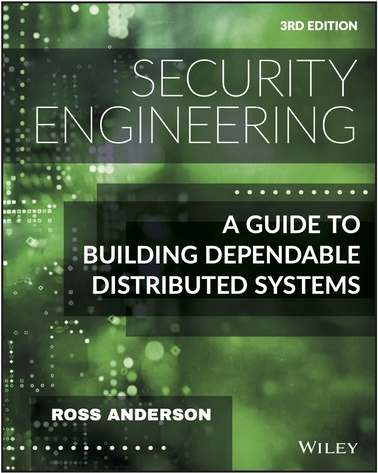

# security-engineering-3rd-edition-ebook 



This is just the script to generate a combined PDF from the currently-online-chapters available for review.

The script also takes care of putting in the right bookmarks for all the chapters in the generated PDF file.

Go read the book from the source at <https://www.cl.cam.ac.uk/~rja14/book.html>

## Chapters

See `titles.txt` for the bookmark titles used by the script.

-   Preface
-   Chapter 1: What is Security Engineering?
-   Chapter 2: Who is the Opponent?
-   Chapter 3: Psychology and Usability
-   Chapter 4: Protocols
-   Chapter 5: Cryptography
-   Chapter 6: Access Control
-   Chapter 7: Distributed Systems
-   Chapter 8: Economics
-   Chapter 9: Multilevel Security
-   Chapter 10: Boundaries
-   Chapter 11: Inference Control
-   Chapter 12: Banking and Bookkeeping
-   Chapter 13: Physical Protection
-   Chapter 14: Monitoring and Metering
-   Chapter 15: Nuclear Command and Control
-   Chapter 16: Security Printing and Seals
-   Chapter 17: Biometrics
-   Chapter 18: Physical Tamper Resistance
-   Chapter 19: Side Channels
-   Chapter 20: Advanced Cryptographic Engineering
-   Chapter 21: Network Attack and Defence
-   Chapter 22: Phones
-   Chapter 23: Electronic and Information Warfare
-   Chapter 24: Copyright and DRM
-   Chapter 25: Taking Stock
-   Chapter 26: Surveillance or Privacy?
-   Chapter 27: Secure Systems Development
-   Chapter 28: Assurance and Sustainability
-   Chapter 29: Beyond 'Computer Says No'
-   Bibliography

## How to generate the book?

Run `./generate.sh`. You will need `pdftk`, and `wget` installed. Alternatively, you can run it using Docker:grinning:

### Docker

```
docker run --detach --name security-engineering-ebook captn3m0/security-engineering-ebook
7553d55547603b0e3d47332f4cd55a126ace10e0e965547b0fae06e3c7b16229

docker logs security-engineering-ebook -f
Starting PDF download
All PDFs downloaded
PDF files combined
Bookmarks attached to PDF
PDF File generated: security-engineering-3rd-edition.pdf

docker cp security-engineering-ebook:/security-engineering-ebook/security-engineering-3rd-edition.pdf .
```

Once the script finishes running, check the `security-engineering-3rd-edition.pdf` file.

### More Options?

You can run with the following 2 options:

`--generate-metadata`

To generate the meta.txt file which contains the list of bookmarks to be inserted. This is required if you make changes to the file lists.
This also requires `qpdf` to be installed.

`--download-cover-image`

Download the cover image. The repo already has [a `cover.pdf` file which](https://www.cl.cam.ac.uk/~rja14/Papers/SEv3-cover.pdf) is used by default. Do this if the cover URL changes. Requires `wget` to be installed.

## Support the Authors

Buy the second editions from:

-   [Amazon.com](http://www.amazon.com/exec/obidos/ASIN/0470068523/rossandersshomep)
-   [Wiley](http://he-cda.wiley.com/WileyCDA/HigherEdTitle/productCd-0470068523.html)
-   [Amazon.co.uk](http://www.amazon.co.uk/exec/obidos/ASIN/0470068523/rossandersshomep)
-   [Kindle Version](http://www.amazon.co.uk/gp/product/B004BDOZI0/ref=as_li_tf_tl?ie=UTF8&tag=rossanderssho-21&linkCode=as2&camp=1634&creative=6738&creativeASIN=B004BDOZI0)

A combined PDF of the first edition is available directly from the author at <http://www.cl.cam.ac.uk/~rja14/musicfiles/manuscripts/SEv1.pdf>.

## Contributing

The list of URLs is maintained at `urls.txt` and might need to be updated. File a PR if this breaks?

## Extra

A list of my other EBook generation projects: https://captnemo.in/ebooks/, includes a link to other related projects as well

## License

The little code in this repo is licensed under the [MIT License](https://nemo.mit-license.org/). See LICENSE file for details.
